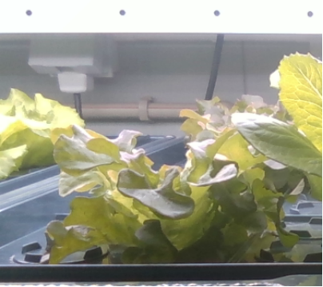
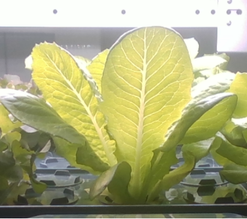
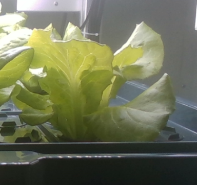
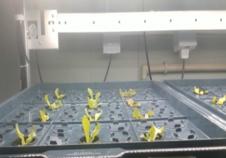
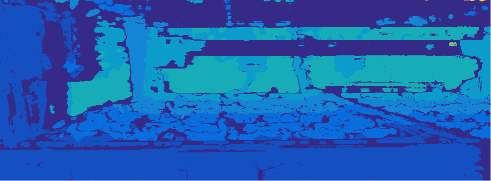

# 🥬 Lettuce Phenotype Dataset from Multimodal Images

This dataset is associated with the research article:

**"Lettuce architectural phenotypes extraction from multimodal images by low‑light sensitivity and strong spatial perception"**  
Published in *Computers and Electronics in Agriculture*, Volume 232, May 2025 :contentReference[oaicite:1]{index=1}

**DOI / Article page:**  
[View on ScienceDirect](https://www.sciencedirect.com/science/article/pii/S0168169925000341?ref=pdf_download&fr=RR-2&rr=977331744e85099d)

## 📁 Dataset Description

This dataset was collected in a Plant Factory with Artificial Lighting (PFAL) located in Shanghai, China, and is designed for robust multimodal phenotype extraction under controlled hydroponic conditions.

- **Multimodal Images**:
  - **RGB**: Standard color images
  - **Infrared (IR)**: Less sensitive to lighting disturbance
  - **Depth**: Captures 3D spatial structure
- **Resolution**: All images are 1280 × 720 in PNG format
- **Hardware**: Captured with Intel® RealSense™ D435i depth camera
- **Camera Placement**: Side-view, approximately 37 cm from lettuce
- **Capture Frequency**: Once per hour, from 9:00 AM to 11:00 PM daily

### 🌱 Lettuce Cultivation and Experimental Design

- **Lettuce Varieties**: Three commonly cultivated types:
  - *Bixiao*
  - *Huqian*
  - *Mondai*
- **Growth Stages**: Germination (15 days) → Transplanting → Growth (30 days)
- **Total Duration**: From **September 15, 2023 to November 18, 2023**, covering **two complete growing cycles**
- **Number of Plants**: 72 plants per variety per batch (i.e., per growth cycle)

> ✨ **Two separate batches were grown and recorded**. In this study:
> - The **first batch** was used for training the deep learning model  
> - The **second batch** was reserved entirely for validation and evaluation

---


## 📸 Dataset Figures

### **Figure 1**: Three varieties of lettuce  

<table>
  <tr>
    <td></td>
    <td></td>
    <td></td>
  </tr>
  <tr>
    <td align="center">(a) Mondai</td>
    <td align="center">(b) Bixiao</td>
    <td align="center">(c) Huqian</td>
  </tr>
</table>

---

### **Figure 2**: Different image formats  

<table>
  <tr>
    <td></td>
    <td></td>
    <td></td>
  </tr>
  <tr>
    <td align="center">(a) RGB</td>
    <td align="center">(b) IR</td>
    <td align="center">(c) Depth</td>
  </tr>
</table>

---

### **Figure 3**: Lettuce at different growth stages  

<table>
  <tr>
    <td></td>
    <td></td>
    <td></td>
    <td></td>
  </tr>
  <tr>
    <td align="center">(a) Seedling</td>
    <td align="center">(b) Early</td>
    <td align="center">(c) Middle</td>
    <td align="center">(d) Mature</td>
  </tr>
</table>


### 🏷️ Annotation

- Images were labeled using **LabelImg**
- All detected targets are annotated as `"lettuce"` with bounding boxes
- Dataset split:
  - Training set: 9,000 images
  - Validation set: 8,000 images
  - Test set: 1,000 images

This design ensures the generalization capability of the model across different growth cycles and lighting conditions within a PFAL setting.


##  Download the Dataset

- **File**: `lettuce_data.zip` (contains all multimodal images and annotations)
- **Baidu Netdisk Link**: [https://pan.baidu.com/s/1o-0gKlYD7mL7BULXn4W3rA?pwd=p9tw](https://pan.baidu.com/s/1o-0gKlYD7mL7BULXn4W3rA?pwd=p9tw) 
- **Extraction Code**: `2aky`  
  *(Shared via Baidu Netdisk Super‑Member v1)*

---

##  Citation (BibTeX)

```bibtex
@article{lu2025lettuce,
  title={Lettuce architectural phenotypes extraction from multimodal images by low‑light sensitivity and strong spatial perception},
  author={Lu, Shenglian and Lv, Yibo and Qian, Tingting and Ren, Wenyi and Li, Xiaoming and Li, Yiyang and Li, Guo},
  journal={Computers and Electronics in Agriculture},
  volume={232},
  pages={109928},
  year={2025},
  publisher={Elsevier},
  doi={10.1016/j.compag.2025.109928}
}
